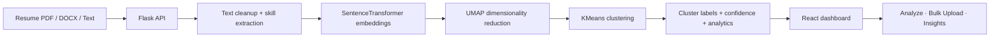

# SkillMap

<div align="center">

**AI-powered resume intelligence for clustering candidates by real skill signals, not keyword noise.**

[](https://react.dev/)
[](https://vitejs.dev/)
[](https://flask.palletsprojects.com/)
[](https://www.python.org/)

</div>

SkillMap turns a resume folder into a searchable talent map. The backend extracts and clusters resume embeddings, the frontend presents the results in a clean product dashboard, and the platform gives recruiters a fast way to review candidates by skill profile instead of manually scanning every document.

## Visual Overview



## What SkillMap Does

- Groups resumes into skill-based clusters using pretrained ML artifacts.
- Predicts the best-fit cluster for a single resume with confidence scoring.
- Supports bulk screening for screening workflows and CSV export.
- Surfaces cluster summaries, skill distributions, and resume analytics.
- Accepts pasted text or uploaded PDF and DOCX resumes.

## Screens In The App

- Dashboard: high-level metrics, cluster cards, and top skills.
- Analyze: single-resume analysis with direct upload support.
- Bulk Upload: batch screening and exportable results.
- Insights: cluster and skill charts for quick review.

## Tech Stack

### Backend
- Flask
- SentenceTransformers
- UMAP
- KMeans
- pandas, numpy, scikit-learn
- python-docx / PDF text parsing dependencies

### Frontend
- React 18
- Vite
- Framer Motion
- Recharts
- Lucide React
- pdfjs-dist
- mammoth

### Data And Models
- `Resume.csv`
- `models/bert_model_name.pkl`
- `models/umap_reducer.pkl`
- `models/kmeans_model.pkl`
- `models/cluster_names.pkl`
- `models/cluster_results.csv`

## Project Structure

```text
SkillMap/
├── backend/
│   ├── app.py
│   └── requirements.txt
├── frontend/
│   ├── src/
│   ├── index.html
│   └── package.json
├── models/
├── Resume.csv
└── README.md
```

## Local Setup

### 1. Backend

Create a virtual environment and install dependencies:

```bash
python -m venv .venv
.venv\Scripts\activate
pip install -r backend/requirements.txt
```

Run the API:

```bash
python backend/app.py
```

The API runs on `http://localhost:5000` by default.

### 2. Frontend

Install dependencies and start the Vite dev server:

```bash
cd frontend
npm install
npm run dev
```

The app runs on `http://localhost:5173` by default.

### 3. Environment Variables

Copy `.env.example` to `.env` and adjust values as needed.

## API Reference

| Method | Route | Purpose |
| --- | --- | --- |
| POST | `/predict` | Predict the best cluster for one resume |
| GET | `/clusters` | Return all clusters and summary metadata |
| POST | `/bulk-predict` | Predict clusters for multiple resumes |
| GET | `/stats` | Return analytics, totals, and top skills |
| GET | `/clusters/<id>/resumes` | Return resumes inside a specific cluster |
| GET | `/health` | Health check |

## Example Workflow

1. Upload or paste a resume.
2. The backend cleans the text and extracts skill signals.
3. The model predicts the closest cluster and confidence.
4. The dashboard surfaces the cluster, top skills, and related analytics.

## Notes

- The backend loads the saved model artifacts on startup.
- The frontend expects the API base URL in `VITE_API_URL` when deployed.
- If you deploy the frontend separately, run the Flask app behind a production WSGI server such as Waitress or Gunicorn.
- The repo is designed to work on Windows and local development environments.

## Why This Project Exists

Recruiting workflows often fail because they treat resumes as unstructured text blobs. SkillMap turns the workflow into a structured talent map so teams can review candidates by cluster, skill density, and similarity instead of reading every resume manually.
